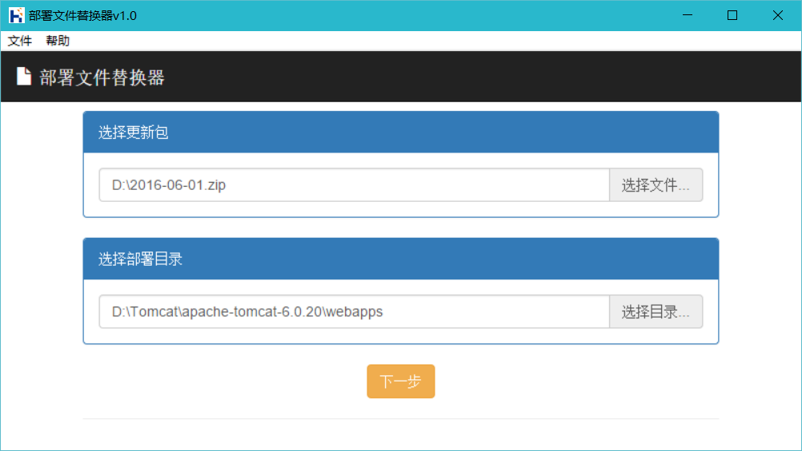
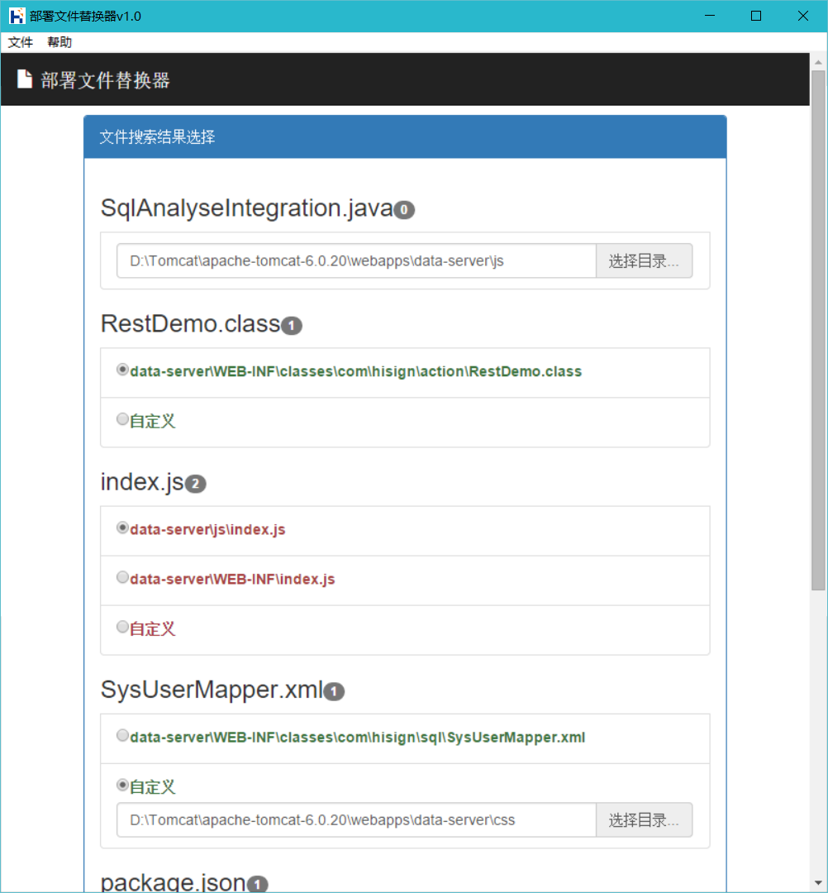
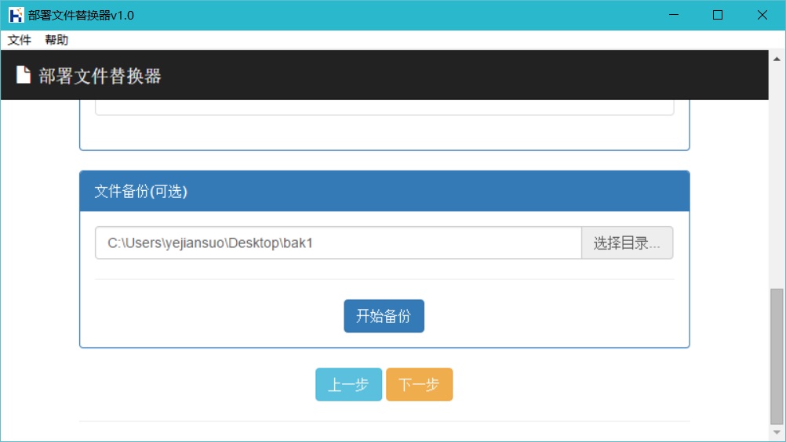
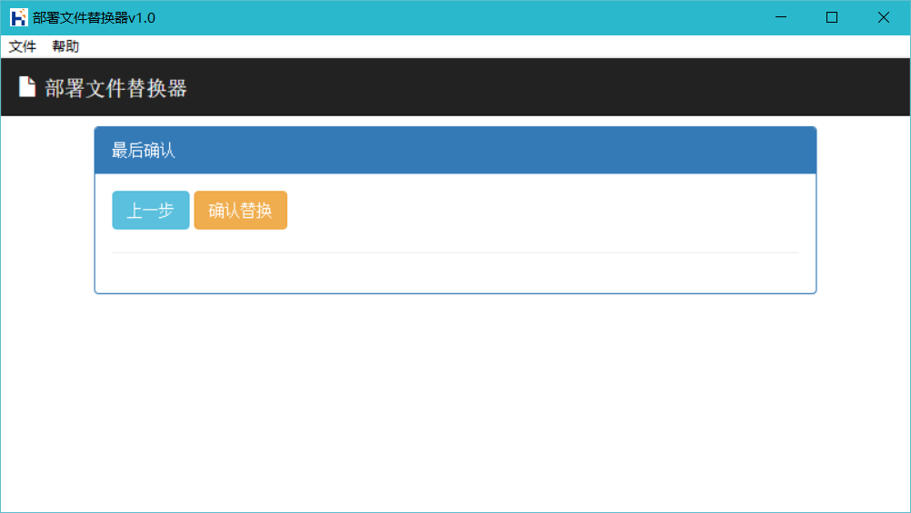

## 部署文件替换器使用帮助

### 第一步:选择更新包与部署目录

1. 点击【选择文件】，选择zip格式压缩包，压缩包里直接放更新文件，不要有文件夹
2. 点击【选择目录】，选择部署目录，一般选择webapps下的项目文件夹即可
3. 点击【下一步】，工具开始在部署目录中查找压缩包里的同名文件

###  第二步: 确认替换文件

文件搜索结果如图展示，需要人工确认，共有4种情况(图从上到下)

1. 在部署目录中没有找到文件（如这个文件是新增的）,需要手工选择目录
2. 只找到一个文件，这个搜索结果就是要替换的目标, 不需要干预
3. 找到多个同名的文件，需要选择一个正确的目标
4. 找到一个或多个文件，但都不是要替换的目标，需要手工选择目录

###  第三步: 备份文件

备份文件是可选操作，点击【选择目录】，选好备份目的地，点击【开始备份】，工具开始备份文件

工具只会备份部署目录中会被替换的文件，新增或部署目录以外的文件不会被备份

1. 点击【上一步】，回到更新包选择与部署目录选择页面
2. 点击【下一步】，跳到最终确认页面

###  第四步: 最终确认

1. 点击【上一步】，回到确认替换文件与文件备份页面
2. 点击【确认替换】，工具开始替换（拷贝）文件

### 第五步: 还原操作

如果想还原被替换的文件，只需要将备份的文件压缩成zip包，使用工具重新替换即可

