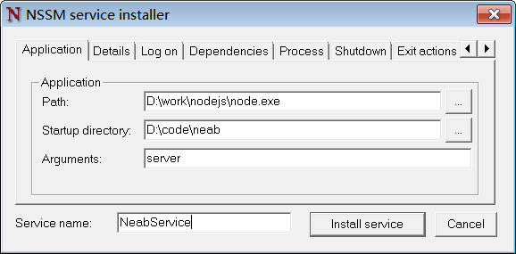

## neab工程部署

### 主要作用

neab工程包含一些基础服务，包括文件(图片)上传，登录登出日志记录，客户端更新等服务。

### 安装依赖

* nodejs
* mongodb

部署前需要安装nodejs与mongodb， 且nodejs版本>= 4.4.5

### 部署步骤

1. 解压缩neab.zip 到任意目录，比如D:\code\neab ,下称部署目录

2. 修改服务端口与数据库配置，其中端口在server.js 中修改(16行)，数据库配置在resource\setting.json 中修改db_url 

3. 在部署目录使用命令窗口输入 nssm install 打开服务安装界面。

4. 在安装界面Application选项卡，如图

   

   Path 选择Nodejs安装目录下node.exe路径

   Startup directory 选择部署目录

   Arguments 填写 server 或 server.js

   Service name 填写NeabService 或自己定义其他。

5. 填好参数后点击 Install service ，将neab工程安装为windows系统服务。

6. 启动服务，在部署目录使用命令窗口输入 nssm start NeabService 启动服务（nssm stop NeabService 停止服务， nssm restart NeabService 重启服务）。

7. 浏览器访问 http://ip:port 验证是否部署成功。

   ​

