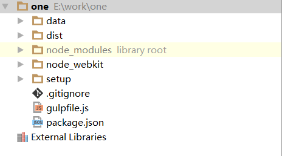

## 一体化客户端打包

### 安装环境

打包开始前，需要安装下列软件

* [Node](ftp://192.168.1.168/%BF%CD%BB%A7%B6%CB/%B4%F2%B0%FC/innosetup5505.exe)
* [Inno Setup](ftp://192.168.1.168/%BF%CD%BB%A7%B6%CB/%B4%F2%B0%FC/node-v4.4.5-x64.msi)

### 克隆代码

```shell
git clone http://192.168.1.103/root/one.git
```

使用webstorm 从代码仓库克隆代码，克隆后的文件结构如下



其中**data**与**dist** 文件夹为一体化代码， **node_modules** 文件夹刚开始不存在，需要安装依赖生成。

### 安装依赖

```shell
npm install
```

在webstorm的命令窗口(Terminal) , 使用上面命令安装依赖, 完成后生成**node_modules** 文件夹。

### 修改配置

根据Inno Setup安装路径的不同和one工程克隆存放路径的不同，需要修改配置文件。

**修改setup文件夹下的setup.js 文件，修改下列2处**

```javascript
exports.InnoSetupPath = "D:\\InnoSetup5\\ISCC.exe";

exports.InnoSetupConfig = "E:\\work\\one\\setup\\setup.iss";
```

InnoSetupPath 是Inno Setup安装根目录下ISCC.exe的绝对路径

InnoSetupConfig 是setup文件夹下的setup.iss文件的绝对路径

**修改setup文件夹下的setup.iss 文件，修改下列2处**

注意，webstorm打开会有乱码，所以使用Inno Setup软件打开。

```shell
#define ExeOutputDir "D:\"
#define AppDistDir "E:\work\one\tmp"
```

ExeOutputDir 是exe安装文件生成存放目录

AppDistDir 是one工程根目录下的tmp文件夹的绝对路径

### 生成安装包

```shell
gulp
```

在webstorm的命令窗口(Terminal) , 使用上面命令生成安装包, 完成后会在`{ExeOutputDir}` 目录生成windows安装包。


###  


