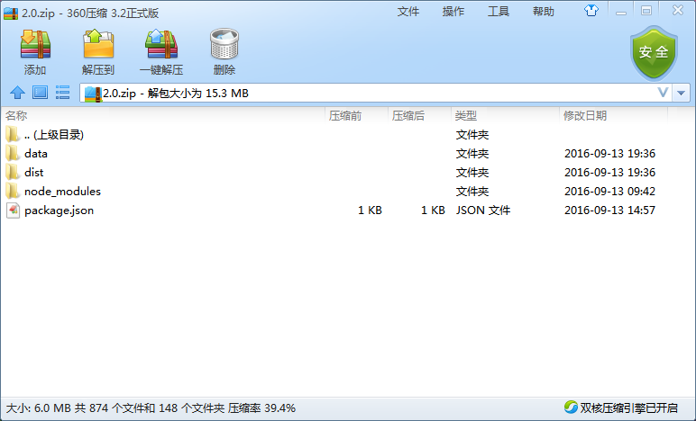
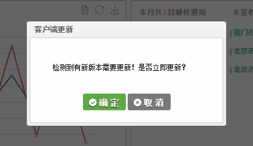

## 一体化客户端更新步骤 

### 准备更新包

更新包要求

* 名称为版本号，文件格式为zip（压缩成rar再改成zip无效）

* 更新包中必须包含package.json文件，且package.json文件中version属性需要更改成最新

* 更新包中还可以包含data、dist、node_modules文件夹，根据是否需要更新情况添加

  

### 部署更新包

需要安装neab基础服务，详见[基础服务部署](neab.md)

将更新包拷贝到neab部署目录下的 api\client\resource\one 文件夹下，并修改one.json文件的version属性成最新版本。

访问 `http://ip:port/api/client/one/version` 能获取最新版本号

访问 `http://ip:port/api/client/one/version/2.0.zip` 能下载最新更新包 （2.0.zip修改成你最新版本的更新包）

### 更新客户端

打开一体化客户端，等待5秒，会有更新提示

​

点击确定，客户端开始更新并重启。重启后验证是否更新成功。
